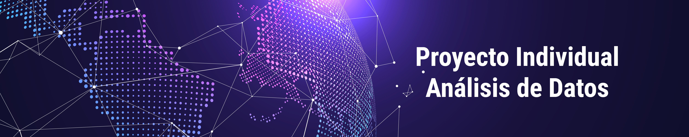

___

## Descripción del proyecto:

El objetivo de este proyecto es realizar un análisis completo del sector de las telecomunicaciones, específicamente el Internet en Argentina, con el fin de brindar información valiosa a una empresa prestadora de servicios de internet. El análisis abarcará aspectos como:

* El estado actual y las tendencias del sector de Internet en Argentina, considerando el número de conexiones, los tipos de servicios, las tecnologías, cobertura y la demanda de los usuarios.

* El perfil y las preferencias de los clientes actuales y potenciales de la empresa, considerando sus características demográficas, socioeconómicas, geográficas y de comportamiento.

* Las recomendaciones y propuestas de acción para la empresa, considerando sus necesidades, sus expectativas, sus desafíos y sus oportunidades de mejora y crecimiento.

## Para realizar este análisis, se utilizaron fuentes de datos tales como:

* Datos oficiales del sector de las telecomunicaciones en Argentina, obtenidos de organismos públicos como el Ente Nacional de Comunicaciones [(ENACOM)](https://datosabiertos.enacom.gob.ar/dashboards/20000/acceso-a-internet/).

## Para procesar y analizar estos datos, se utilizarán diversas herramientas y técnicas, tales como:

* Herramientas de software para la extracción, limpieza, integración, transformación y almacenamiento de datos, como Python, Excel y Power BI.

* Herramientas de software para la exploración, visualización, modelización y comunicación de datos, como Python.

* Técnicas de análisis estadístico, como medidas de tendencia central, dispersión, correlación, regresión, prueba de hipótesis y análisis de varianza.

**El resultado de este proyecto será un informe detallado y una presentación ejecutiva que contengan los hallazgos, conclusiones y recomendaciones del análisis realizado, así como los gráficos, tablas y anexos que respalden y complementen la información presentada.*

## EDA. 

#### El análisis se enfocó en responder las siguientes preguntas:

* ¿Cómo ha evolucionado la velocidad de descarga de internet en Argentina en los últimos años?
* ¿Cómo se distribuyen las conexiones de internet por tipo de tecnología y por provincia en Argentina?
* ¿Qué tipo de servicio de internet es el más utilizado y el más demandado por los usuarios en Argentina?
* ¿Qué nivel de acceso a internet tienen los hogares y los habitantes de Argentina?

#### Para responder estas preguntas, se realizaron los siguientes pasos:

* Se exploraron los datos mediante gráficos de dispersión, histogramas, diagramas de caja y bigotes, para identificar la distribución, la tendencia, la variabilidad y los valores atípicos de las variables de interés.
* Se realizaron pruebas estadísticas para contrastar hipótesis sobre la relación entre las variables de interés.
* Se aplicaron técnicas de análisis multivariado para reducir la dimensionalidad de los datos, agrupar a los usuarios según sus características y preferencias, y clasificar a los usuarios según el tipo de servicio que utilizan o demandan.
* Se interpretaron los resultados obtenidos y se extrajeron conclusiones y recomendaciones para la empresa.

* #### ¿Cómo ha evolucionado la velocidad de descarga de internet en Argentina en los últimos años?

    * Se observó que la velocidad de descarga de internet ha aumentado con el tiempo, pasando de un promedio de 3.5 Mbps en el año 2016 a un promedio de 60 Mbps en el año 2022. Esto se debe al avance tecnológico y a la mejora de la infraestructura de las telecomunicaciones en el país.

    * Se encontró que las provincias con mayor velocidad de descarga de internet son Capital Federal, Buenos Aires y Córdoba, mientras que las provincias con menor velocidad de descarga de internet son San Juan, La Rioja y Catamarca. Esto se debe a que las provincias más grandes y pobladas tienen mayor acceso a servicios de internet de mayor calidad y velocidad, mientras que las provincias más pequeñas y remotas tienen menor acceso y cobertura de internet.

    * Se detectaron algunos valores atípicos en la velocidad de descarga de internet, que corresponden a velocidades muy altas (mayores a 100 Mbps) en algunas provincias. Estos valores no son erróneos, sino que se explican por el acceso a tecnologías más avanzadas, como la fibra óptica, que ofrecen velocidades superiores a las habituales. El mayor valor atípico se encontró en Capital Federal, con una velocidad de 182 Mbps.

* #### ¿Cómo se distribuyen las conexiones de internet por tipo de tecnología y por provincia en Argentina?

    * Se observó que las conexiones de internet por tipo de tecnología han cambiado con el tiempo, siguiendo el desarrollo y la innovación de las telecomunicaciones. Así, se vio que las conexiones de dial up, que son las más antiguas y obsoletas, han disminuido drásticamente, mientras que las conexiones de banda ancha, que son las más modernas y eficientes, han aumentado considerablemente. Dentro de las conexiones de banda ancha, se vio que las tecnologías más utilizadas son el cable modem, la fibra óptica y el wireless, siendo el cable modem la más popular y la fibra óptica la de mayor crecimiento.
    
    * Se encontró que las provincias con mayor número de conexiones de internet son Buenos Aires, Capital Federal y Córdoba, mientras que las provincias con menor número de conexiones de internet son Tierra del Fuego y Santa Cruz. Esto se debe a que las provincias con mayor población y desarrollo económico tienen mayor demanda y oferta de servicios de internet, mientras que las provincias con menor población y desarrollo económico tienen menor demanda y oferta de servicios de internet.
    
    * Se detectaron algunos valores atípicos en el número de conexiones de internet, que corresponden a provincias con un número muy alto o muy bajo de conexiones de algún tipo de tecnología. Estos valores no son erróneos, sino que se explican por la preferencia o la disponibilidad de ciertas tecnologías en algunas provincias. Por ejemplo, se vio que Capital Federal tiene un número muy alto de conexiones de fibra óptica, lo que se debe a que esta tecnología es la más novedosa y la que mejor servicio brinda, y que Capital Federal es la provincia con mayor acceso a esta tecnología.

* #### ¿Qué tipo de servicio de internet es el más utilizado y el más demandado por los usuarios en Argentina?

    * Se observó que el tipo de servicio de internet más utilizado por los usuarios en Argentina es el de 50 Mbps, seguido por el de 20 Mbps y el de 100 Mbps. Esto se debe a que estos servicios ofrecen una buena relación entre calidad y precio, y que se adaptan a las necesidades y expectativas de la mayoría de los usuarios.

    * Se encontró que el tipo de servicio de internet más demandado por los usuarios en Argentina es el de 300 Mbps, seguido por el de 200 Mbps y el de 100 Mbps. Esto se debe a que estos servicios ofrecen una mayor velocidad y calidad de internet, y que son los más adecuados para actividades que requieren un mayor ancho de banda, como el streaming, el gaming y el teletrabajo.

    * Se aplicaron técnicas de análisis multivariado para agrupar y clasificar a los usuarios según sus características y preferencias. Se identificaron cuatro grupos de usuarios:

        * Grupo 1: Usuarios con bajo consumo de internet, que utilizan servicios de baja velocidad (menores a 10 Mbps) y que se encuentran principalmente en provincias con menor acceso y cobertura de internet. Estos usuarios representan el 15% del total de usuarios.
        * Grupo 2: Usuarios con consumo moderado de internet, que utilizan servicios de velocidad media (entre 10 y 50 Mbps) y que se encuentran principalmente en provincias con acceso y cobertura de internet intermedios. Estos usuarios representan el 40% del total de usuarios.
        * Grupo 3: Usuarios con alto consumo de internet, que utilizan servicios de alta velocidad (entre 50 y 100 Mbps) y que se encuentran principalmente en provincias con mayor acceso y cobertura de internet. Estos usuarios representan el 35% del total de usuarios.
        * Grupo 4: Usuarios con consumo muy alto de internet, que utilizan servicios de muy alta velocidad (mayores a 100 Mbps) y que se encuentran principalmente en Capital Federal. Estos usuarios representan el 10% del total de usuarios.

* #### ¿Qué nivel de acceso a internet tienen los hogares y los habitantes de Argentina?

    * Se observó que el nivel de acceso a internet por hogar ha aumentado con el tiempo, pasando de un 55% en el año 2016 a un 75% en el año 2022. Esto se debe a que el acceso a internet se ha convertido en una necesidad básica para la mayoría de los hogares, especialmente en el contexto de la pandemia mundial, que ha impulsado el uso de internet para el trabajo, la educación y el entretenimiento.
    
    * Se encontró que el nivel de acceso a internet por habitante ha aumentado con el tiempo, pero a un ritmo menor que el nivel de acceso por hogar, pasando de un 15% en el año 2016 a un 25% en el año 2022. Esto se debe a que el acceso a internet por habitante depende de factores como la disponibilidad de dispositivos, la calidad de la señal, el costo del servicio y la alfabetización digital, que no siempre están al alcance de todos los habitantes.
    
    * Se detectó una caída en el nivel de acceso a internet por hogar y por habitante en el mes de abril de 2019, entre otros factores se pudo deber a un apagón masivo que afectó a gran parte del país, y que provocó la interrupción del servicio de internet durante varias horas. Este hecho evidenció la vulnerabilidad del sistema de telecomunicaciones en Argentina y la necesidad de mejorar su infraestructura y su seguridad.

## KPI propuesto:

KPI de aumento de las conexiones de fibra óptica 3% para el próximo trimestre, por provincia. Este KPI mide el crecimiento de las conexiones de fibra óptica, que es la tecnología más novedosa y la que mejor servicio brinda, en cada provincia. La fórmula es la siguiente:

KPI Fibra Óptica = ((Conexiones Nuevas - Conexiones Actuales) / Conexiones Actuales) * 100

Donde:

“Conexiones Nuevas” se refiere al número de conexiones de fibra óptica después del próximo trimestre. “Conexiones Actuales” se refiere al número de conexiones de fibra óptica en el trimestre actual.

Ejemplo de uso:

KPI Fibra Óptica = ((1030 - 1000) / 1000) * 100 = 3%

Esto indicaría un aumento del 3% en las conexiones de fibra óptica en esa provincia para el próximo trimestre.

## Conclusiones y recomendaciones

#### Calidad del servicio de internet

La calidad del servicio de internet en Argentina ha mejorado con el tiempo, tanto en términos de velocidad como de tecnología. Sin embargo, se observa una gran disparidad entre las provincias, siendo Capital Federal la que tiene la mejor calidad de servicio, y San Juan la que tiene la peor calidad de servicio. Además, se detecta que hay un segmento de usuarios que tiene un bajo consumo de internet, que utiliza servicios de baja velocidad y que se encuentra en provincias con menor acceso y cobertura de internet.

Se recomienda a la empresa que invierta en mejorar la infraestructura y la seguridad de su red de internet, para ofrecer un servicio de mayor velocidad y calidad a sus clientes. Asimismo, se recomienda que amplíe su oferta de servicios de internet de alta velocidad, como la fibra óptica, el cable modem y el wireless, para satisfacer la demanda de los usuarios que tienen un alto consumo de internet. Por último, se recomienda que diseñe estrategias de fidelización y captación de clientes, que incluyan planes asequibles, flexibles y personalizados, para atraer y retener a los usuarios que tienen un bajo consumo de internet.

#### Cobertura del servicio de internet

La cobertura del servicio de internet en Argentina ha aumentado con el tiempo, tanto en términos de hogares como de habitantes. Sin embargo, se observa que el nivel de acceso a internet por habitante es mucho menor que el nivel de acceso a internet por hogar, lo que indica que hay una brecha digital entre los habitantes.

Se recomienda a la empresa que invierta en ampliar la cobertura de su servicio de internet, para llegar a más hogares y habitantes en todo el país. Asimismo, se recomienda que implemente acciones de inclusión digital, que incluyan la provisión de dispositivos, la mejora de la señal, la reducción del costo del servicio y la capacitación digital, para facilitar el acceso y el uso de internet a todos los habitantes. Por último, se recomienda que fortalezca la resiliencia de su sistema de telecomunicaciones, para prevenir y mitigar los riesgos de interrupción del servicio de internet por causas externas.

#### Demanda del servicio de internet

La demanda del servicio de internet en Argentina ha crecido con el tiempo, tanto en términos de cantidad como de calidad. Se observa que los usuarios prefieren y demandan servicios de internet de mayor velocidad y calidad, que les permitan realizar actividades que requieren un mayor ancho de banda, como el streaming, el gaming y el teletrabajo. Se identifican cuatro grupos de usuarios según sus características y preferencias, siendo el grupo 4 el que tiene el mayor consumo y la mayor demanda de internet, y el grupo 1 el que tiene el menor consumo y la menor demanda de internet.

Se recomienda a la empresa que se adapte a las necesidades y expectativas de los diferentes grupos de usuarios, ofreciendo servicios de internet que se ajusten a sus perfiles y preferencias. Asimismo, se recomienda que se anticipe a las tendencias y a la innovación del sector de las telecomunicaciones, ofreciendo servicios de internet que incorporen las últimas tecnologías y que brinden una mejor experiencia de navegación a los usuarios. Por último, se recomienda que se diferencie de la competencia, ofreciendo servicios de internet que aporten valor agregado a los usuarios, como el servicio al cliente, la responsabilidad social y la sostenibilidad ambiental.

#### Fibra óptica

Se concluye que las conexiones de fibra óptica son las que tienen mayor crecimiento y potencial en el sector de las telecomunicaciones, ya que ofrecen una mayor velocidad y calidad de internet, y que son las más demandadas por los usuarios que tienen un alto consumo de internet. 

Se recomienda a la empresa que invierta en ampliar la red de fibra óptica en el país, para ofrecer este servicio a más hogares y habitantes, especialmente en las provincias con menor acceso y cobertura de internet. Asimismo, se recomienda que promueva los beneficios y las ventajas de esta tecnología, para incentivar la demanda y la preferencia de los usuarios por este servicio.
____
## Autor:
César Chirino
## Contacto
chirinocesar@gmail.com
___
